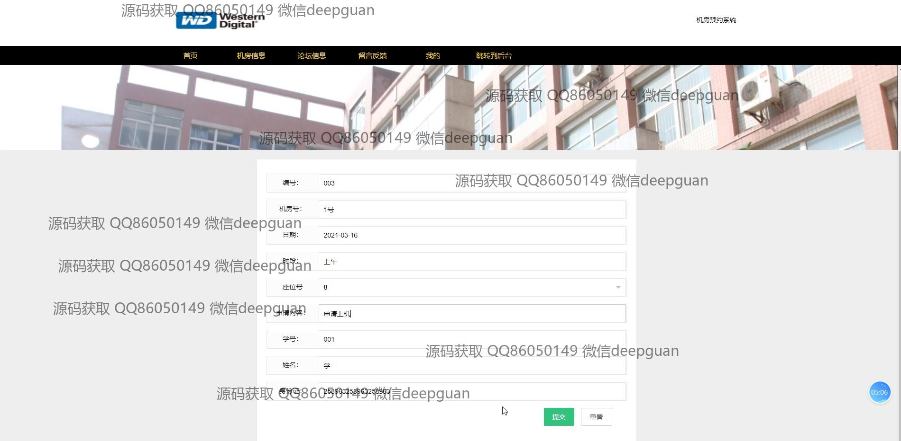
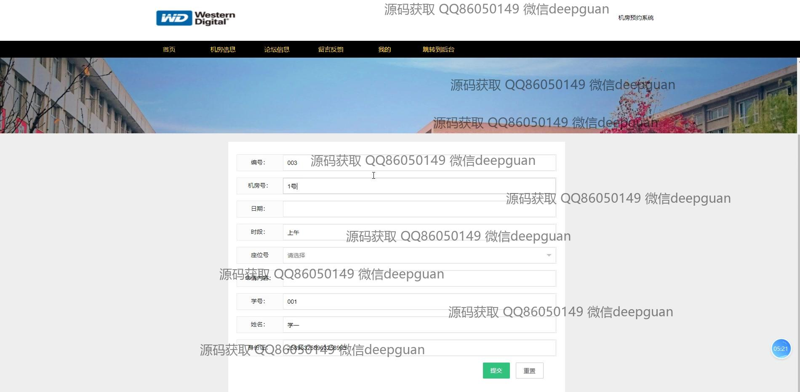
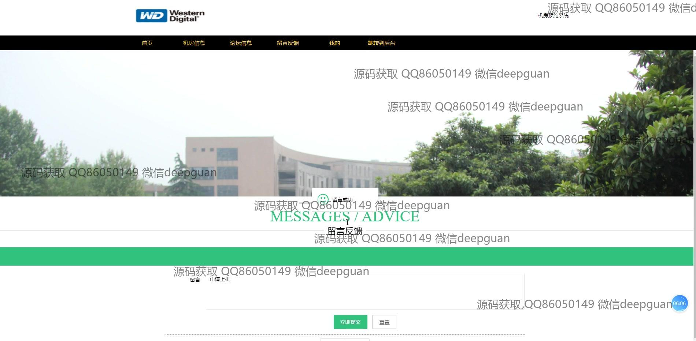
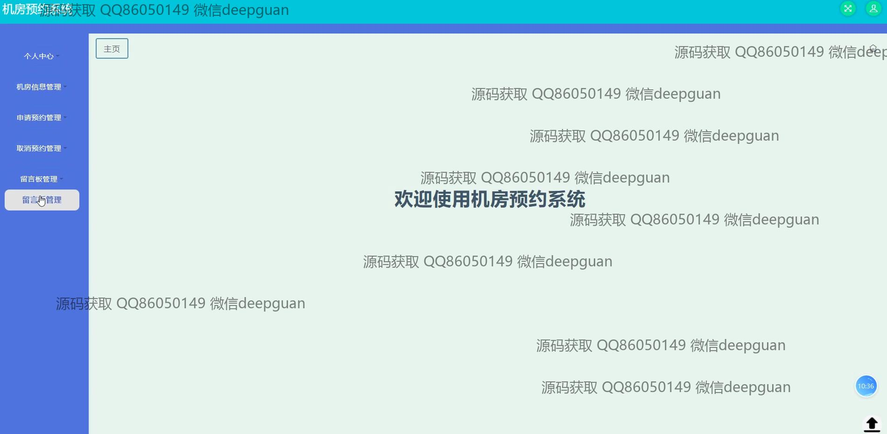
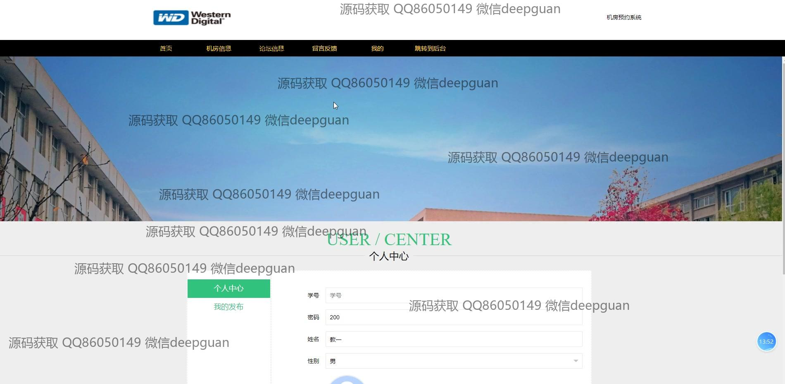

<h1 align="center">的机房预约系统</h1>

## 简介
机房预约系统：角色分为学生、教师和管理员；主要功能涵盖用户注册与登录、个人信息管理、机房信息管理、预约申请与取消、留言反馈及论坛互动等多个模块。    --计算机毕业设计源码；毕设源码；java毕业设计源码

## 联系方式

<h3 align="center">获取完整代码与数据库文件 + 微信：deepguan QQ: 86050149 QQ群: 783742310</h3>

<h3 align="center">可帮忙远程部署 包运行成功！提供远程部署、修改代码、设计文档指导、代码讲解等服务！</h3>

## 功能介绍（完整见运行截图）
管理员：基本功能包括注册、登录和退出，操作界面设有个人中心、学生和教师管理、机房管理以及系统管理等模块。管理员可以进行机房预约信息的查询、审核、查看和删除，管理留言和论坛信息，并维持系统的整体运行。网站提供简洁明了的操作界面和导航栏，帮助用户快速访问不同功能区域。

教师：教师用户通过登录界面对个人信息进行编辑，包括工号、姓名、性别、职称、联系方式等。此外，教师可通过系统进行机房的申请和取消预约，管理预约记录和状态，以及访问留言板和论坛以进行交流和反馈。

学生：学生可以通过注册界面创建新账户，登录后可填写预约信息，例如机房号、日期、时段和座位号，并上传相关文件。系统允许学生查看预约状态和历史记录，也可访问个人中心进行信息修改。

普通用户：普通用户可以通过主页访问机房信息、论坛和留言反馈功能。用户可浏览和发帖，查看和提交预约申请，包括详细的身份信息表单填写，同时可管理留言和查看论坛信息。系统导航清晰，操作直观便捷，以提升用户使用体验。

## 运行截图

本代码来源于网络,仅供学习参考使用!

